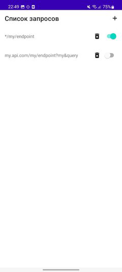
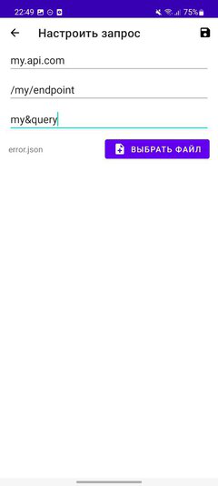
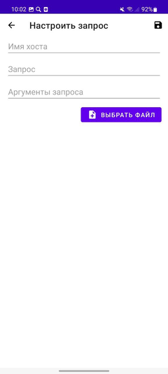
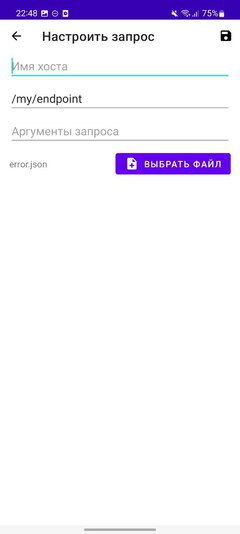

Приложение для подмены ответов состоит из двух частей:
- Приложение для управления списком подменяемых запросов
- Подключаемая к коду разрабатываемого приложения библиотека

При этом несколько разрабатываемых приложений с подключенной библиотекой будут использовать одну базу запросов из приложения для управления списком запросов.

Подмена происходит после получения ответа от сервера. При этом подменяется только тело ответа, остальные параметры не меняются.

Приложение для подмены можно использовать при включенном vpn

[Собранное приложение для управления списком запросов](https://github.com/vladimirlisovskij/simple-mocker/releases/download/1.0-alpha1/app-release.apk)

# Главный экран
На главном экране представлен хранящийся в приложении список запросов. Каждую запись можно
-   изменить — нажать на запись,
-   удалить — нажать на значок корзины
-   включить/выключить — изменить положение свитча.

Новые записи добавляются при нажатии на кнопку «+»

# Экран создания запроса

При нажатии на «+» на главном экране произойдет переход на экран создания запроса.

Доступно для заполнения:
-   Имя хоста — можно оставить пустым чтобы подменять запрос с любым хостом
-   Запрос — обязательно к заполнению, путь  необходимого запроса
-   Аргументы запроса — набор аргументов, разделенных значком «&». Порядок записи значения не имеет. Можно оставить пустым чтобы подменять запрос с любыми аргументами
-   Json-файл — ответ, который будет подставляться при совпадении трех вышеперечисленных параметров.

При нажатии на «Выбрать файл» пользователю будет предложен выбор файла из локальных и удаленных источников. Из локальных источников можно выбирать только *.json файлы. Из удаленных источников можно выбирать любые файлы (будет исправлено в будущем). При выборе файла его имя будет выведено слева от кнопки.

Для сохранения файла нужно нажать на значок дискеты. Если все поля заполнены верно, то произойдет переход к главному экрану.

# Экран редактирования запроса

При нажатии на кнопку «Просмотреть текущий файл» будет предложен выбор приложения для просмотра текущего подставляемого json-ответа. В остальном функционал экрана идентичен экрану создания запроса

# Подключение библиотеки

Добавить зависимость

	com.github.vladimirlisovskij:simple-mocker:1.0-alpha1

Подключить сервис к приложению

	if (BuildConfig.DEBUG) {  
		MockerServiceHelper.registerMocker(application)  
	}

Добавить перехватчик запросов

    OkHttpClient.Builder().apply {
	    if (BuildConfig.DEBUG) {
		    addInterceptor(MockerInterceptor(context))  
	    }
    }
